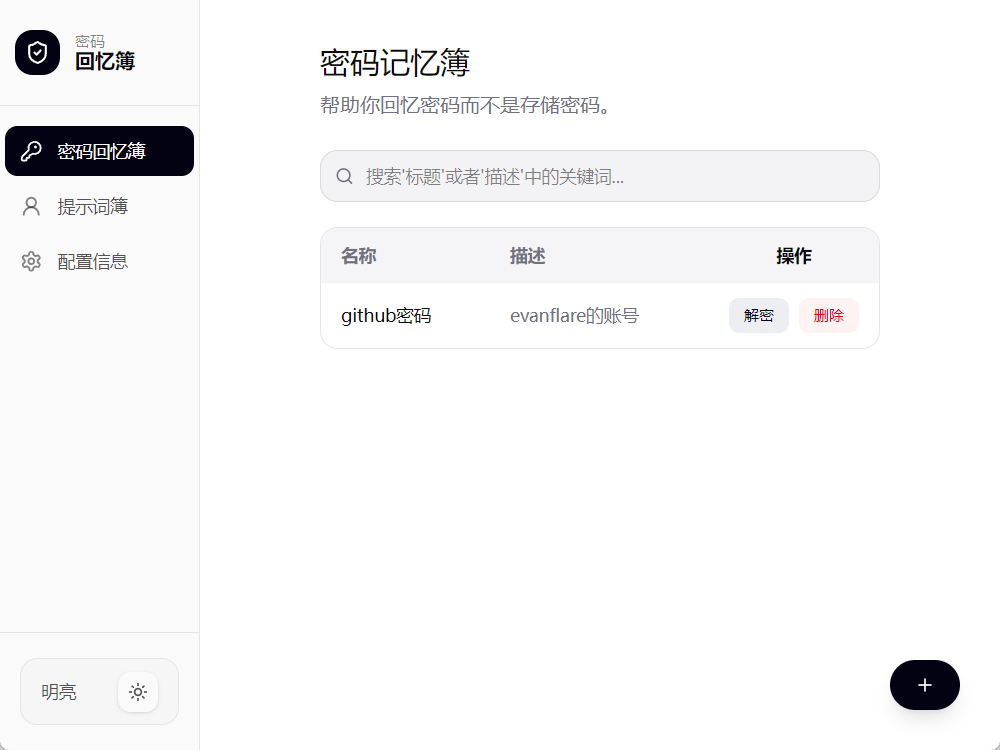
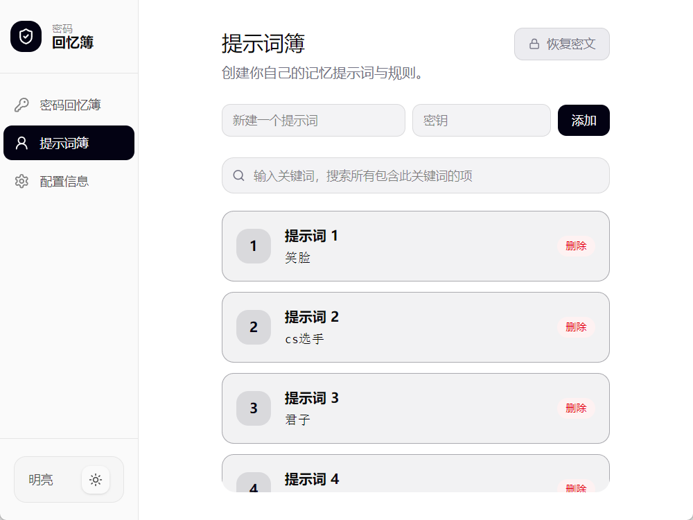
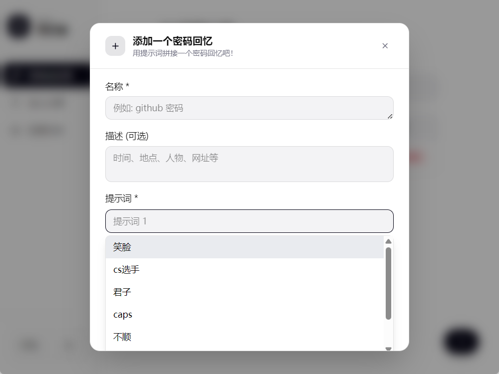

<p align="center">
  <a href="https://github.com/Evanflare/passwd-memory-points/">
    <picture>
      <source media="(prefers-color-scheme: dark)" srcset="images/Logo_dark.gif">
      
    </picture>
  </a>
</p>

<h3 align="center">密码回忆、提示词与规则管理和加密的工具</h3>
<br>
<div align="center">
</div>
<p align="center"><a href="https://github.com/Evanflare/passwd-memory-points/"></a></p>

# memoria 免费的密码回忆构建、管理和迁移工具

>  memoria 音似'memory'意为'记忆'，取回忆的寓意。

memoria 是一个开源免费具有创新性的密码回忆工具。为解决密码遗忘、记忆混乱的问题，以第一性原理为引，开发了以回忆密码为核心的功能的 memoria 项目。

memoria 帮助我们回忆密码，而不存储密码。通过每个人独特的提示词规则来帮助用户建立自己的密码回忆簿。通过提示词组成个人专属回忆，并且能通过已有提示词与规则，快速构建新的密码回忆。

> 不存储而是帮助用户回忆，将密码的窥探阻断在大脑的记忆之外

memoria 采用强加密算法加密已有提示词簿明文以及密码回忆簿明文，又因为提示词与规则的私有、独特性使得存储的密码回忆几乎不能被用于暴力破解密码。

## 下载安装

支持Windows与Android平台，安装包发布在 [github release页](https://github.com/Evanflare/passwd-memory-points/releases)或者 [gitee release页](https://gitee.com/Evanflare/passwd_memory_points/releases)中。

[点击前往下载](https://gitee.com/Evanflare/passwd_memory_points/releases)

## 为什么用 memoria?

memoria 结合的创新概念密码回忆，私有提示词规则，使得密码的安全性与密码回忆的便捷性大大提升。它是完全免费开源的，开源的，轻量级的，注重隐私，没有广告。不需要帐户就可以使用 memoria。

memoria 对于拥有大量账号密码，经常忘记密码、害怕泄露密码，以及经常迁移密码或希望备份防止密码遗忘的人员、用户特别有用。它可以作为日常

memoria 的安全性取决于用户所建立的提示词、规则的私密度与复杂度。这种安全性是直观的，如果你需要足够的安全性，建立复杂提示词规则搭配 memoria 即可实现安全与便捷。

## 特点

memoria 最大的特点就是“只存储提示词与规则，不存储密码”，安全性取决与用户所建立的规则。

1. 不直接存储密码，只有加密后的存储提示词与规则
4. 可随意导入导出
5. 一键更换加密密钥
6. 支持 windows + android
7. 本地存储无需联网功能

建立一个自己私有的密码回忆提示词与规则系统，保存在线下介质中隐蔽保存，可以避免遗忘并且保证足够的安全性。

## 快速开始

### 1. 建立自己的提示词与规则

**提示词**，当看到这个提示词的时候我们能想到的密码片段。通常可以借助音似、意象、事件、爱好、形似等等联想的方式来建立提示词。

如：
```shell
尾8 -> &          #音似，留尾的8意思就是&
笑 -> ^v^         #形似
cs选手 -> s1mple  #爱好，最喜欢的cs选手
君子 -> lian      #意向，莲花之君子者也
```

**规则**，不对应具体的密码片段，而是对某密码片段生效。通常的规则有首字母变换、顺序变换、新增后缀等。

如：
```shell
caps ->   #取capslock意，后接密码片段的首字母大写
不顺 ->   #不顺则反，将后接的密码片段字母顺序逆反
鹅喷的 -> #append，后接密码片段追加一个自定义的后缀
```

> 别让提示词与规则这么直白，一定要做只有自己知道的提示词与规则。

### 2. 存入提示词簿

将提示词与规则存入提示词簿，memoria 会加密存储。



### 3. 新建密码回忆

在“密码回忆簿”页点击右下按钮新建，提示词部分可从提示词簿中选中，或自定义输入。



## 软件文档
